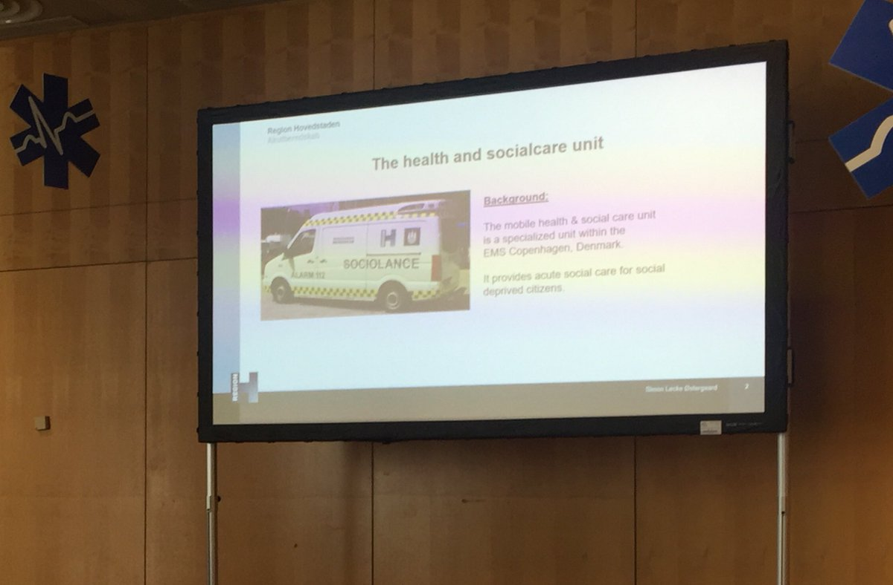

# EMS 2019

--- 



<h2 style="color:#eeeeee;">Stroke chain of survival</h2>

         

<a class="small" href="https://twitter.com/lukemorrison89/status/1121718765773889538">@lukemorrison89</a> 

---

## Utstein guidelines for stroke

1. Stroke registry
2. Early recognition
3. Structural
4. Pre-hospital
5. Emergency Care

---

## Utstein guidelines for stroke

1. Establish a stroke registry
2. Create public awareness
3. Start public education
4. Improve early recognition
5. Practice rapid and timely dispatch
6. Optimise prehospital stroke care and triage
7. Optimise in-hospital basic and advanced care
8. Using smart technologies
9. Demonstrate accountability
10. Create a culture of excellence

---

## In-hospital basic and advanced care

+ **Pre-alert by paramedics**
+ Activating stroke team
+ Rapid patient registration
+ **Moving patient direct to CT scanner by EMS**
+ Not waiting for lab results (except e.g. INR)
+ Alteplase (tPA) in the CT scanner

---

## Tony Rudd

+ Stroke burden
+ Only 5% benefit from revascularisation
+ Critical of ambulance response and on-scene times
+ Paramedics/hospital clinicians need to work as a team

---

## Major barriers

+ Poor public knowledge/recognition
+ Inefficient pre-hospital/front-door processes
+ Thrombectomy services not yet established

---

## Recognition

+ FAST best of a bad lot
+ 100 patients screened with FAST
  + 62 have stroke/TIA
  + 7 missed

---

## In other news

+ Data linkage project just about to commence in England
  + Will calculate total patient journey time
  + Aiming to justify specialist centres with longer ambulance journey times
+ TR not enthusiastic about stroke ambulances
+ Shortening door to needle time important
  + Pre-alerts
  + Stroke team waiting
  

---

## One more thing...

+ LVO strokes may have longer window for thrombectomy
+ 6--16 hours (even up to 24 hours in one study)
+ Quite specific group (LVO + ischaemic region)

---

#  Major incidents

---

## Post-MAJAX activities
+ Prepare for next major incident
+ Physical and psychological cleaning after current incident required
+ Debrief responders
+ Emphasise current feelings/emotions **normal reaction to non-normal event**
+ Care about the commanders (they made the decisions)
+ Prevent rumours (talk about what happened)

---
## Post-MAJAX activities
 + Take part in memorial ceremonies
 + Prepare for press and politician communication
 + Inform colleagues and other professionals
 + Prepare for the question - ‘Do you need more money?’
 + What’s next (check for next targetable event(s))?
 + Beware of the anniversary

---



## Major Incident Exercise

         

<a class="small" href="https://twitter.com/SAMUR_PC/status/1122179941863514112">@SUMAR_PC</a> 

---



---

# Notable mentions

---

## Sociolance

<a class="small" href="https://twitter.com/Skyder3n/status/1122090846575366144">@Skyder3n</a> 

---

## Balconing



---

# El fin

