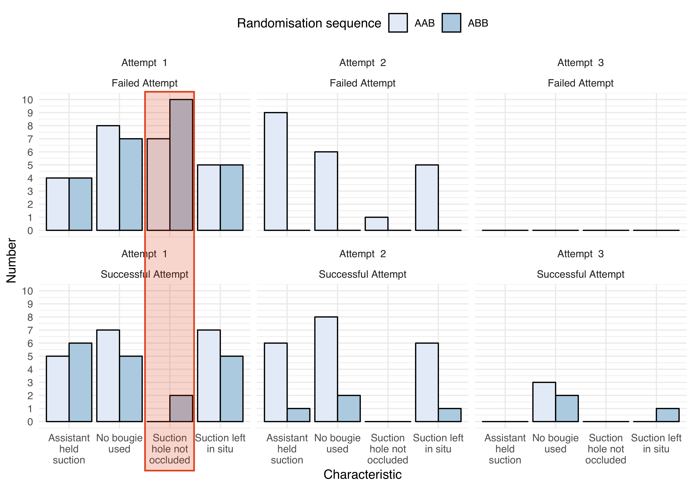



---



--- 


## Suction Assisted Laryngoscopy and Airway Decontamination 

---





---



---


## Study Design

164 paramedics

Two groups, three intubation attempts:

+ AAB: 1 -- 2 -- **Training** -- 3
+ ABB: 1 -- **Training** -- 2 -- 3

---


## Primary Outcome

Proportion of successful intubations between groups on the second intubation attempt

---



## Results

 
SALAD

 <h2>90.2%</h2>

  
No SALAD

 <h2>53.7%</h2>

Difference 36.5%

(95%CI 24.9--49.1%, p<0.001)

---



In this **manikin study**, **paramedics** were able to **intubate a soiled airway** significantly **more often** when using the **SALAD** technique.

---



 

---



## Things to consider

+ Staff who intubate should train for soiled airways
+ Consider suction without vent (vacuum control) hole
